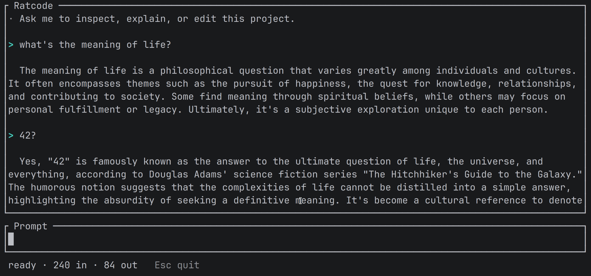

# Ratcode

A deliberately small Codex-style terminal coding agent built with Rig and
Ratatui.

It demonstrates four things:

- Rig's agent builder and OpenAI provider
- typed Tool implementations for reading, writing, and shell commands
- Rig's automatic multi-turn tool loop
- streaming text, tool events, conversation history, and token usage

## Livestream

Watch the Ratcode code walkthrough [on YouTube](https://www.youtube.com/live/hhw741JrQeQ&t=1611).

## License

Ratcode is available under the [MIT License](LICENSE).
